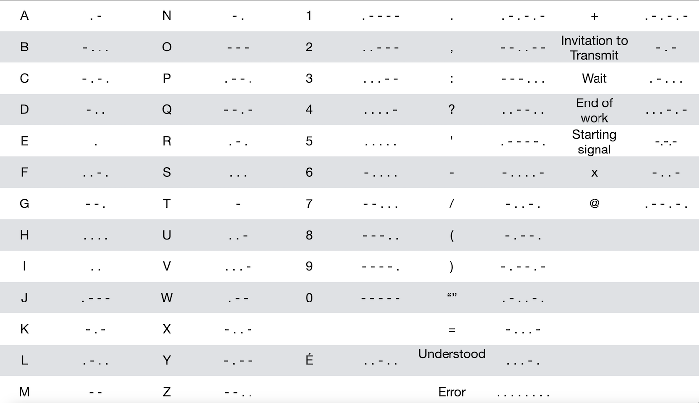

# morse-coder

## Description
Morse code is a telecommunications method which encodes text characters as standardized sequences of two different signal durations, called dots and dashes, or dits and dahs.  Morse code is named after Samuel Morse, one of the early developers of the system adopted for electrical telegraphy.

This Python project converts plain text into Morse code. It's a simple and educational tool that demonstrates string manipulation and basic encoding concepts. Whether you're learning about Morse code or just having fun with text conversion, this tool makes it easy!

International Morse code encodes the 26 basic Latin letters a to z, one accented Latin letter (é), the Arabic numerals, and a small set of punctuation and procedural signals (prosigns). There is no distinction between upper and lower case letters. Each Morse code symbol is formed by a sequence of dots and dashes. The dot duration can vary for signal clarity and operator skill, but for any one message, once established it is the basic unit of time measurement in Morse code.

The definitive references for International Morse code https://www.itu.int/dms_pubrec/itu-r/rec/m/R-REC-M.1677-1-200910-I!!PDF-E.pdf

## International Morse Code
1. The length of a dot is one unit.
2. A dash is three units.
3. The space between parts of the same letter is one unit.
4. The space between letters is three units.
5. The space between words is seven units.


# Text to Morse Code Converter
## Features
* Converts English text into Morse code.
* Supports letters A-Z (case insensitive), numbers 0-9, and basic punctuation.
* Handles spaces between words appropriately in the output.

## Demo
Include a screenshot or GIF showing your program in action.

## Installation
#### Prerequisites
* Python 3.x installed on your machine.
* (Optional) A virtual environment for isolated dependencies.

### Steps
1. Clone this repository:
```
git clone https://github.com/Garschke/text-to-morse-code.git
cd text-to-morse-code
```
2. (Optional) Create and activate a virtual environment:
```
python3 -m venv venv
source venv/bin/activate   # On Windows use: venv\Scripts\activate
```
3. Install dependencies (if any):
```
pip install -r requirements.txt
```
### Usage
Run the converter:
```
python main.py
```
Enter the text you want to convert when prompted.
View the Morse code output.
Example:
```
Enter text to convert: Hello World
.... . .-.. .-.. --- / .-- --- .-. .-.. -..
```

### Morse Code Reference


## Roadmap
* [ ] Add support for decoding Morse code back to text.
* [ ] Implement a GUI using Tkinter or PyQt.
* [ ] Add sound output for Morse code.

## Contributing
Contributions are welcome!

## Fork the repository.
1. Create your feature branch: git checkout -b feature/NewFeature
2. Commit your changes: git commit -m 'Add new feature'
3. Push to the branch: git push origin feature/NewFeature
4. Open a pull request.
## License
This project is licensed under the MIT License - see the LICENSE file for details.

## Acknowledgments
Inspiration from traditional Morse code learning tools.
Wikipedia for the Morse code reference.
